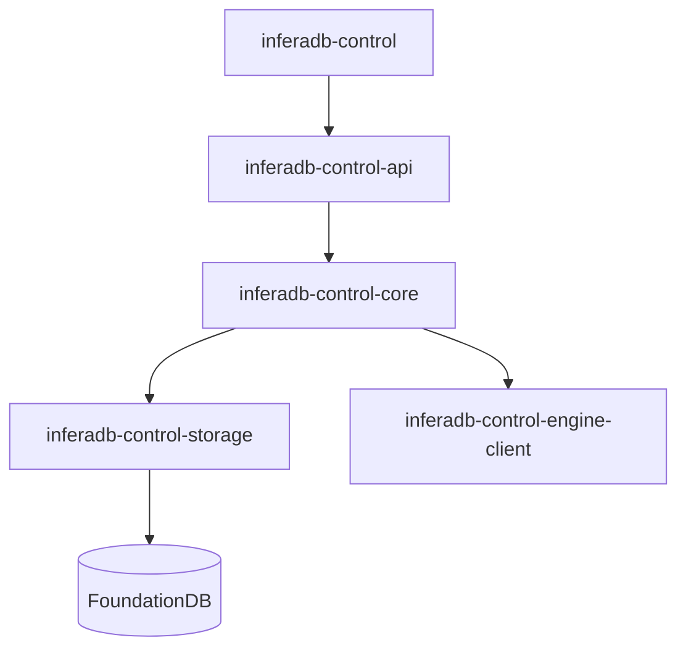

# InferaDB Control Plane

Multi-tenant administration headless APIs, Kubernetes-native deployment, and WebAuthn authentication.

> [!IMPORTANT]
> Under active development. Not production-ready.

## Quick Start

```bash
git clone https://github.com/inferadb/control && cd control
docker-compose up -d
export INFERADB_CTRL__AUTH__KEY_ENCRYPTION_SECRET=$(openssl rand -base64 32)
make setup && make dev
```

Register and login:

```bash
# Register
curl -X POST http://localhost:9090/v1/auth/register \
  -H "Content-Type: application/json" \
  -d '{"email": "alice@example.com", "password": "securepass123", "name": "Alice"}'

# Login
curl -X POST http://localhost:9090/v1/auth/login/password \
  -H "Content-Type: application/json" \
  -d '{"email": "alice@example.com", "password": "securepass123"}'
```

| Endpoint | URL                             |
| -------- | ------------------------------- |
| REST API | `http://localhost:9090`         |
| gRPC API | `http://localhost:9091`         |
| Mesh API | `http://localhost:9092`         |
| Health   | `http://localhost:9090/healthz` |
| Metrics  | `http://localhost:9090/metrics` |

## Features

| Feature              | Description                                  |
| -------------------- | -------------------------------------------- |
| **Authentication**   | Password, passkey, OAuth, email verification |
| **Multi-Tenancy**    | Organization-based isolation with RBAC       |
| **Vault Management** | Policy containers with access grants         |
| **Client Auth**      | Ed25519 certificates, JWT assertions         |
| **Token Issuance**   | Vault-scoped JWTs for Engine API             |

## Key Concepts

| Entity       | Description                                   |
| ------------ | --------------------------------------------- |
| User         | Account with auth methods (password, passkey) |
| Organization | Workspace with members and roles              |
| Vault        | Authorization policy container                |
| Client       | Service identity with Ed25519 certs           |
| Team         | Group-based vault access                      |

**Auth Flow:** User → Session → Vault access → JWT → Engine API

## Architecture



| Crate                          | Purpose                  |
| ------------------------------ | ------------------------ |
| inferadb-control               | Binary entrypoint        |
| inferadb-control-api           | REST/gRPC handlers       |
| inferadb-control-core          | Business logic, entities |
| inferadb-control-storage       | Memory or FoundationDB   |
| inferadb-control-types         | Shared type definitions  |
| inferadb-control-engine-client | Engine API client        |

## Configuration

```yaml
control:
  listen:
    http: "0.0.0.0:9090"
    grpc: "0.0.0.0:9091"
    mesh: "0.0.0.0:9092"

  webauthn:
    party: "localhost"
    origin: "http://localhost:9090"
```

Environment variables use `INFERADB_CTRL__` prefix (e.g., `INFERADB_CTRL__LISTEN__HTTP`).

See [config.yaml](config.yaml) for all options.

## Development

```bash
make setup                    # One-time setup
make dev                      # Dev server with auto-reload
make test                     # Run tests
make check                    # Format, lint, audit
cargo build --release         # Release build
```

## Deployment

```bash
docker run -p 9090:9090 inferadb/control:latest
kubectl apply -k k8s/
```

See [docs/deployment.md](docs/deployment.md) for Kubernetes.

## Documentation

| Topic           | Link                                               |
| --------------- | -------------------------------------------------- |
| Getting Started | [docs/getting-started.md](docs/getting-started.md) |
| Authentication  | [docs/authentication.md](docs/authentication.md)   |
| Architecture    | [docs/architecture.md](docs/architecture.md)       |
| API Reference   | [openapi.yaml](openapi.yaml)                       |

## License

[InferaDB Non‑Commercial Source License](LICENSE.md)
