# Authentication Flow

## Table of Contents

- [Overview](#overview)
- [Two-Token Architecture](#two-token-architecture)
- [Complete Authentication Flow](#complete-authentication-flow)
- [JWT Claims Structure](#jwt-claims-structure)
  - [Claim Descriptions](#claim-descriptions)
- [Vault Token Response Format](#vault-token-response-format)
- [Refresh Token Flow](#refresh-token-flow)
  - [Refresh Token Security Properties](#refresh-token-security-properties)
- [Authentication Methods](#authentication-methods)
  - [1. Password Authentication](#1-password-authentication)
  - [2. Passkey Authentication (WebAuthn/FIDO2)](#2-passkey-authentication-webauthfido2)
  - [3. CLI OAuth Flow](#3-cli-oauth-flow)
  - [4. Client Assertion (Recommended for Backend Services)](#4-client-assertion-recommended-for-backend-services)
    - [Client Assertion Flow](#client-assertion-flow)
    - [Client Assertion Benefits](#client-assertion-benefits)
    - [Client Assertion Security](#client-assertion-security)
  - [5. Single-Page Applications (SPAs)](#5-single-page-applications-spas)
    - [Correct SPA Architecture](#correct-spa-architecture)
- [Server API Token Validation](#server-api-token-validation)
- [Security Considerations](#security-considerations)
  - [Token Lifetimes](#token-lifetimes)
  - [Cryptographic Signing](#cryptographic-signing)
  - [Token Scoping](#token-scoping)
  - [Revocation](#revocation)
- [Integration Points](#integration-points)
  - [Management API Responsibilities](#management-api-responsibilities)
  - [Server API Responsibilities](#server-api-responsibilities)

## Overview

The **Management API** acts as the central authentication orchestrator for the entire InferaDB system. This architecture allows the **Server API** to focus exclusively on authorization policy enforcement and decision evaluation, while delegating all identity and authentication concerns to the Management API.

## Two-Token Architecture

InferaDB uses a **two-token system** to maintain clean separation of concerns:

1. **Session Tokens** - Used for Management API operations

   - Identity and account management
   - Organization and vault administration
   - User profile and settings
   - Authentication method management

2. **Vault-Scoped JWTs** - Used for Server API operations
   - Policy evaluation requests
   - Relationship graph queries
   - Authorization decisions
   - Fine-grained access control

This separation ensures that authentication (identity) and authorization (policy) remain distinct concerns handled by their respective services.

## Complete Authentication Flow


## JWT Claims Structure

Vault-scoped JWTs issued by the Management API contain the following claims:

```json
{
  "iss": "tenant:<organization_id>",
  "sub": "tenant:<organization_id>",
  "aud": "https://api.inferadb.com/evaluate",
  "exp": 1234567890,
  "iat": 1234567800,
  "vault_id": 777888999,
  "vault_role": "WRITER",
  "scope": "vault:read vault:write"
}
```

### Claim Descriptions

- **iss** (Issuer): The tenant/organization that issued the token (format: `tenant:<org_id>`)
- **sub** (Subject): The tenant/organization making the request (format: `tenant:<org_id>`)
- **aud** (Audience): Target service (Server API evaluation endpoint)
- **exp** (Expiration): Unix timestamp when token expires
- **iat** (Issued At): Unix timestamp when token was created
- **vault_id**: The vault ID this token grants access to
- **vault_role**: Permission level (READER, WRITER, MANAGER, ADMIN)
- **scope**: Space-separated permissions (e.g., "vault:read vault:write")

## Vault Token Response Format

When a client requests a vault access token, the Management API returns:

```json
{
  "access_token": "<jwt>",
  "refresh_token": "<cryptographic_token>",
  "token_type": "Bearer",
  "expires_in": 3600,
  "refresh_expires_in": 86400,
  "vault_id": "<snowflake_id>",
  "vault_role": "VAULT_ROLE_WRITER"
}
```

## Refresh Token Flow

Vault access tokens expire after a short duration (typically 1 hour). Clients can use refresh tokens to obtain new access tokens without re-authenticating:


### Refresh Token Security Properties

1. **Single-Use**: Each refresh token can only be used once
2. **Automatic Rotation**: New refresh token issued with each refresh
3. **Replay Detection**: Reused refresh tokens trigger security alerts
4. **Expiration**: Refresh tokens expire after extended period (e.g., 24 hours)
5. **Token Binding**: Bound to specific authentication context

## Authentication Methods

The Management API supports multiple authentication methods:

### 1. Password Authentication

- Traditional email/password login
- Password hashing with modern algorithms (Argon2, bcrypt)
- Rate limiting and brute-force protection

### 2. Passkey Authentication (WebAuthn/FIDO2)

- Hardware-backed cryptographic authentication
- Phishing-resistant
- Platform authenticators (TouchID, Windows Hello) and roaming authenticators (YubiKey)

### 3. CLI OAuth Flow

- OAuth 2.0 with PKCE (Proof Key for Code Exchange)
- Designed for headless/CLI environments
- Browser-based authorization with device code flow

### 4. Client Assertion (Recommended for Backend Services)

- **OAuth 2.0 JWT Bearer** (RFC 7523) for service-to-service authentication
- Cryptographic proof of identity using public key cryptography
- No shared secrets or long-lived credentials to store
- Self-signed JWT assertions prove client identity
- Each assertion is short-lived and unique
- Key rotation without downtime

#### Client Assertion Flow

**ONE-TIME SETUP (Developer Portal)**


**RUNTIME (Every Token Request)**


#### Client Assertion Benefits

1. **No Credential Storage** - Backend apps only store their own private key (which they control)
2. **Cryptographic Proof** - Signed JWTs prove identity without shared secrets
3. **Short-Lived Assertions** - Each assertion expires in 60 seconds, limiting attack window
4. **Replay Protection** - JTI (JWT ID) prevents assertion reuse
5. **Key Rotation** - Update public key in Management API without app downtime
6. **Audit Trail** - Every token request is signed and traceable
7. **Standards-Based** - OAuth 2.0 RFC 7523 (widely supported)
8. **Better Developer Experience** - No password/API key management

#### Client Assertion Security

- **Private Key Protection**: Store private keys in secure vaults (HashiCorp Vault, AWS Secrets Manager, etc.)
- **Key Algorithm**: Ed25519 for fast signing and small signatures (64 bytes)
- **Assertion Lifetime**: Maximum 60 seconds to limit replay attack window
- **JTI Tracking**: Management API maintains short-term cache of used JTIs
- **Rate Limiting**: Per-client rate limits on token endpoint
- **Key Revocation**: Instantly revoke client by deleting public key

### 5. Single-Page Applications (SPAs)

**Important**: InferaDB is an **authorization service**, not an identity provider. Your application's users authenticate with YOUR auth system (Auth0, Clerk, Firebase, etc.), not with InferaDB.

#### Correct SPA Architecture

```mermaid
flowchart TB
    User["👤 End User<br/>(authenticated with YOUR auth)"]
    SPA["🌐 SPA<br/>(React/Vue/etc.)"]
    Backend["🔧 YOUR Backend"]
    InferaDB["🔐 InferaDB<br/>(Management + Server APIs)"]

    User -->|"Your Auth JWT"| SPA
    SPA -->|"API call with user token"| Backend
    Backend -->|"1. Validates user<br/>2. Uses Client Assertion<br/>3. Gets vault token<br/>4. Checks permissions"| InferaDB
    InferaDB -->|"Authorization decision"| Backend
    Backend -->|"Response (show/hide features)"| SPA

    style InferaDB fill:#e1f5ff
    style Backend fill:#fff4e1
    style SPA fill:#f0f0f0
    style User fill:#e8f5e9
```



**Flow**:

1. User authenticates with YOUR auth system (Auth0, Clerk, etc.)
2. SPA receives JWT from YOUR auth system
3. SPA calls YOUR backend with user's JWT
4. YOUR backend validates user's JWT
5. YOUR backend uses **Client Assertion** to get InferaDB vault token
6. YOUR backend calls InferaDB Server API to check permissions
7. YOUR backend returns authorization decision to SPA
8. SPA shows/hides features based on permissions

**Key Points**:

- End users NEVER interact with InferaDB directly
- InferaDB is completely invisible to end users
- Your backend maps user identities (email, user ID, etc.) to InferaDB subjects
- Your backend uses Client Assertion (method #4 above) for InferaDB authentication
- Authorization is enforced by your backend based on InferaDB decisions

See [examples/spa-integration/CORRECT_SPA_ARCHITECTURE.md](../examples/spa-integration/CORRECT_SPA_ARCHITECTURE.md) for complete implementation.

**Alternative: JWT Token Exchange** - For truly serverless frontends where even serverless functions aren't desired, see [examples/spa-integration/TRULY_SERVERLESS_OPTIONS.md](../examples/spa-integration/TRULY_SERVERLESS_OPTIONS.md) for JWT token exchange pattern.

## Server API Token Validation

The Server API validates vault-scoped JWTs without making synchronous calls to the Management API:

1. **Fetch JWKS** (JSON Web Key Set) from Management API's `/.well-known/jwks.json` endpoint
2. **Cache JWKS** with appropriate TTL and refresh mechanism
3. **Verify JWT Signature** using Ed25519 public key from JWKS
4. **Validate Claims**:
   - `aud` matches Server API identifier
   - `exp` is in the future (token not expired)
   - `scope` matches requested vault
   - `vault_role` has sufficient permissions
5. **Execute Policy** with authenticated context

This stateless validation allows the Server API to operate independently while still trusting tokens issued by the Management API.

## Security Considerations

### Token Lifetimes

- **Session Tokens**: Long-lived (days to weeks)
- **Vault Access Tokens (JWT)**: Short-lived (minutes to hours)
- **Vault Refresh Tokens**: Medium-lived (hours to days)

### Cryptographic Signing

- Ed25519 signature algorithm for JWTs
- Fast verification performance
- Small signature size (64 bytes)
- Strong security guarantees

### Token Scoping

- Session tokens scope to user + organization
- Vault tokens scope to specific vault + role
- Prevents privilege escalation across vaults
- Role-based access control (RBAC) enforcement

### Revocation

- Session tokens can be revoked, invalidating all derived vault tokens
- Individual vault tokens automatically expire
- Refresh tokens are single-use, preventing replay attacks
- API keys can be revoked independently

## Integration Points

### Management API Responsibilities

- User identity verification
- Session lifecycle management
- Vault permission checks
- JWT issuance and signing
- JWKS publication for Server API
- Refresh token rotation

### Server API Responsibilities

- JWT signature validation
- Claims verification
- Policy evaluation
- Authorization decisions
- Relationship graph queries

This clean separation allows each service to focus on its core competency while maintaining strong security guarantees across the system.
