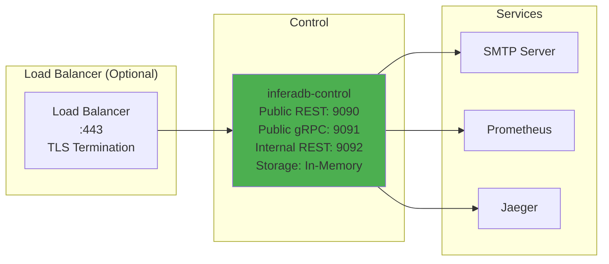
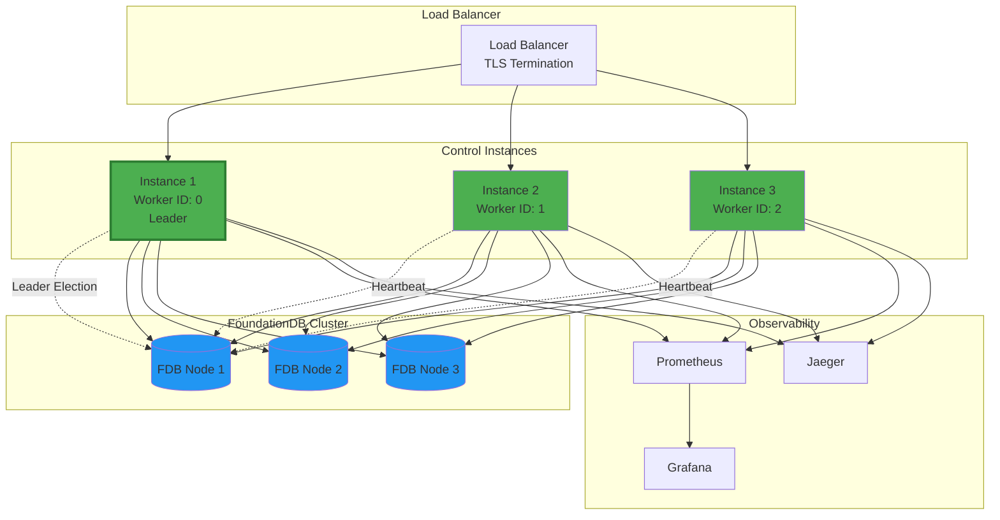
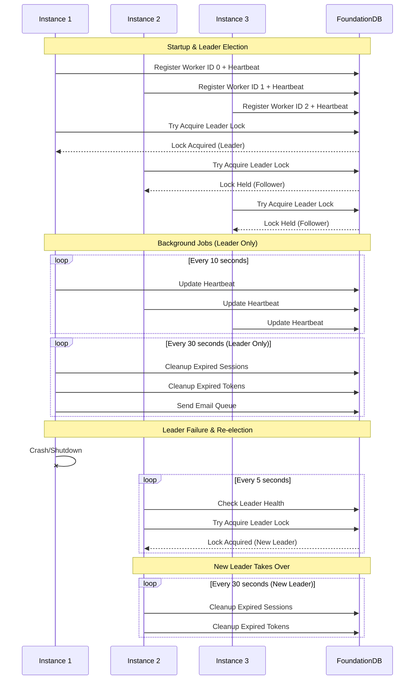
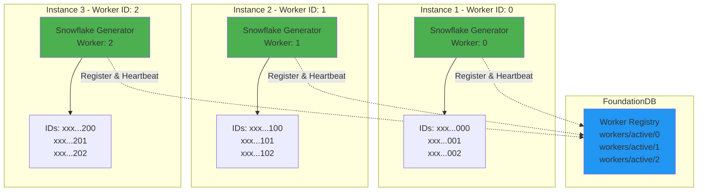
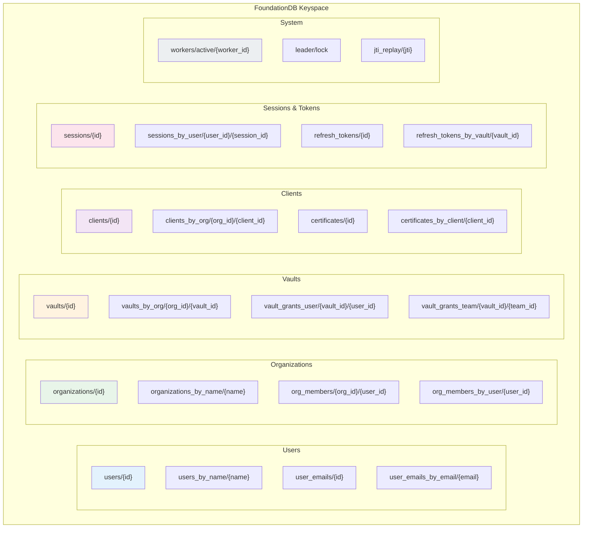
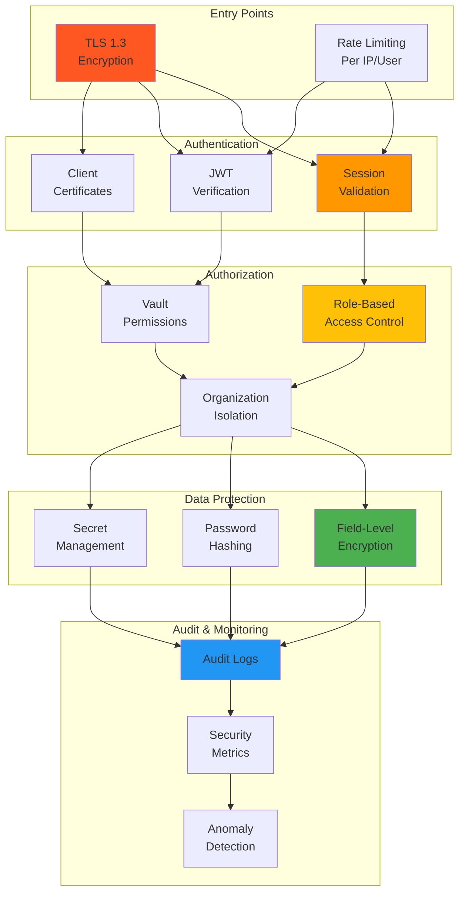
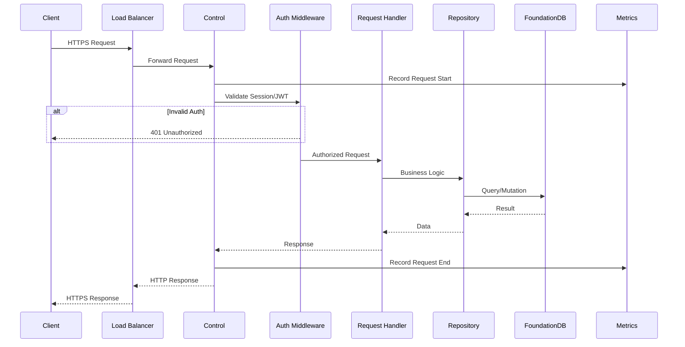
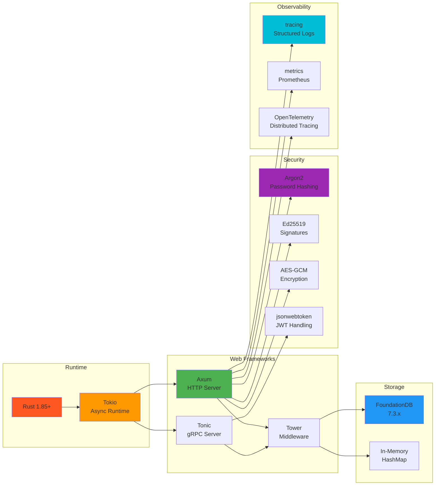
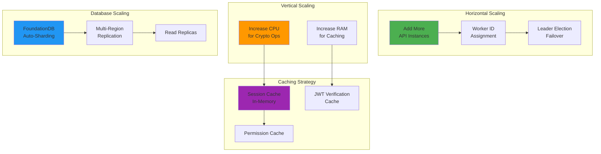

# System Architecture

This document provides visual diagrams of the InferaDB Control architecture, deployment topology, and component interactions.

## Component Architecture

Control follows a layered architecture with clear separation of concerns:

```mermaid
graph TB
    subgraph "Client Layer"
        Dashboard[Web Dashboard]
        CLI[CLI Tools]
        Mobile[Mobile Apps]
    end

    subgraph "API Layer"
        REST[Public REST API<br/>Port 9090]
        GRPC[Public gRPC API<br/>Port 9091]
        Internal[Internal REST API<br/>Port 9092]
    end

    subgraph "Application Layer"
        Auth[Authentication<br/>Handlers]
        Org[Organization<br/>Handlers]
        Vault[Vault<br/>Handlers]
        Client[Client<br/>Handlers]
        Token[Token<br/>Generation]
    end

    subgraph "Core Layer"
        Entities[Entity Models]
        Repos[Repositories]
        Crypto[Cryptography]
        JWT[JWT Service]
        Email[Email Service]
    end

    subgraph "Storage Layer"
        Storage[Storage<br/>Abstraction]
        Memory[Memory<br/>Backend<br/>(Implemented)]
        FDB[FoundationDB<br/>Backend<br/>(Planned)]
    end

    subgraph "External Services"
        Engine[InferaDB Engine<br/>gRPC]
        SMTP[SMTP Server<br/>Email]
        Metrics[Prometheus<br/>Metrics]
        Tracing[Jaeger<br/>Traces]
    end

    Dashboard --> REST
    CLI --> REST
    Mobile --> REST
    Dashboard --> GRPC

    REST --> Auth
    REST --> Org
    REST --> Vault
    REST --> Client
    GRPC --> Auth
    GRPC --> Token

    Auth --> Entities
    Org --> Entities
    Vault --> Entities
    Client --> Entities
    Token --> JWT

    Entities --> Repos
    Repos --> Crypto
    JWT --> Crypto
    Auth --> Email

    Repos --> Storage
    Storage --> Memory
    Storage --> FDB

    Token --> Engine
    Email --> SMTP
    REST --> Metrics
    GRPC --> Metrics
    REST --> Tracing
    GRPC --> Tracing

    style REST fill:#4CAF50
    style GRPC fill:#4CAF50
    style Storage fill:#2196F3
    style Engine fill:#FF9800
```

## Deployment Topology

### Single Instance Deployment



**Important Considerations**:

- All data stored in RAM (no persistence)
- Server restart loses all data
- Ensure adequate RAM allocation (8GB+ recommended)
- Implement regular export/backup procedures

### Multi-Instance Deployment



## Multi-Instance Coordination

How multiple Control instances coordinate for leader election and distributed ID generation:



## ID Generation Strategy

How Worker IDs prevent Snowflake ID collisions across instances:



**Key Points**:

- Each instance has a unique Worker ID (0-1023)
- Worker IDs are embedded in the generated Snowflake IDs
- Collision detection: If Worker ID already registered with recent heartbeat, startup fails
- Heartbeat every 10 seconds keeps Worker ID registered
- Stale registrations (>30s) auto-expire via TTL

## Storage Architecture

### In-Memory Storage

Control supports a HashMap-based in-memory storage backend with the following characteristics:

- All data stored in RAM
- No persistence across restarts
- Suitable for development, testing, and single-instance deployments
- Uses the same logical keyspace structure as planned FoundationDB backend

### FoundationDB Storage

When implemented, data will be organized in FoundationDB keyspace:



## Security Layers

Defense-in-depth security architecture:



## Request Flow

Complete request lifecycle through the system:



## Technology Stack



## Scalability Strategy



## Further Reading

- [Overview](overview.md): Complete entity definitions and data model
- [Authentication](authentication.md): Authentication flows and security model
- [Deployment](deployment.md): Production deployment guide
