# Data Flows

This document illustrates the data flows for key operations in InferaDB Control.

## User Registration Flow

```mermaid
sequenceDiagram
    participant User
    participant API as Control
    participant DB as FoundationDB
    participant Email as Email Service

    User->>API: POST /v1/auth/register<br/>{email, password, name}

    API->>API: Validate Input<br/>(email format, password strength)

    alt Validation Fails
        API-->>User: 400 Bad Request
    end

    API->>DB: Check Email Exists
    DB-->>API: Email Available

    alt Email Already Registered
        API-->>User: 409 Conflict
    end

    API->>API: Hash Password (Argon2)
    API->>API: Generate User ID (Snowflake)
    API->>API: Generate Session ID (Snowflake)
    API->>API: Generate Org ID (Snowflake)
    API->>API: Generate Member ID (Snowflake)

    API->>DB: BEGIN TRANSACTION
    API->>DB: Create User
    API->>DB: Create User Email
    API->>DB: Create User Session
    API->>DB: Create Default Organization
    API->>DB: Create Organization Member (Owner)
    API->>DB: COMMIT TRANSACTION

    API->>API: Generate Email Verification Token
    API->>DB: Store Verification Token

    API->>Email: Send Verification Email
    Email-->>User: Verification Email

    API-->>User: 201 Created<br/>{session_token, user, organization}
```

## Login Flow

## Token Generation Flow

## Organization Creation Flow

## Vault Access Grant Flow

## Client Certificate Generation Flow

## Refresh Token Flow

## Email Verification Flow

## Password Reset Flow

## Multi-Instance Leader Election Flow

## Audit Log Flow

## Team-Based Vault Access

**Resulting Permissions:**

- **Alice**: Can edit Production (via Engineering), can view Staging (via Engineering)
- **Bob**: Can edit Production (via Engineering), can admin Production (via Security), can view Staging (via Engineering)
- **Charlie**: Can admin Production (via Security)

## Rate Limiting Flow

## Session Cleanup (Background Job)

## Further Reading

- [Architecture](architecture.md): System architecture diagrams and deployment topology
- [Authentication](authentication.md): Detailed authentication mechanisms
- [Overview](overview.md): Complete entity definitions and data model
